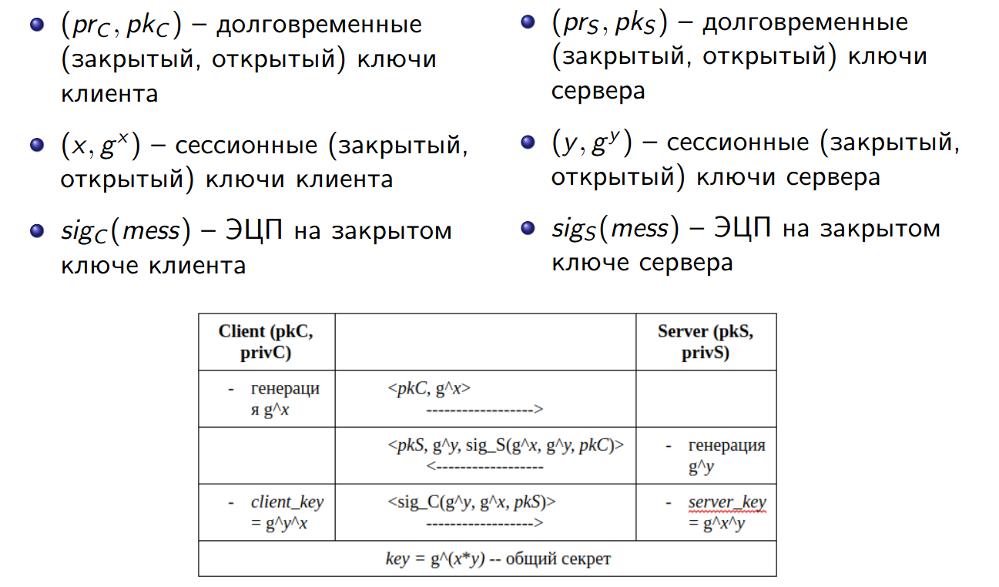

# Задание
Необходимо смоделировать протокол ISO, описываемый следующим образом:



## Проверяемые свойства
Проверить **выполнимость** для утверждений:

- **executable_Finished**: Cуществует сервер, клиент и сессионный ключ такие, что клиент смог установить соединение с сервером
- **executable_1**: Существует сервер, клиент и сообщение такое, что клиент отправил первое сообщение, и сервер его получил
- **executable_2**: Существует сервер, клиент и сообщение такое, что сервер отправил второе сообщение, и клиент его получил
- **executable_3**: Существует сервер, клиент и сообщение такое, что клиент отправил третье сообщение, и сервер его получил

Проверить, что свойства **не выполняются**:

- **Key_secrecy**: Для любого сервера, клиента и сессионного ключа, если клиент смог установить соединение с сервером, то противник не может узнать сессионный ключ
- **auth_1**: Для любого сервера, клиента и сообщения, если клиент смог установить соединение с сервером и сервер получил первое сообщение, то его отправил именно клиент
- **auth_2**: Для любого сервера, клиента и сообщения, если клиент смог установить соединение с сервером и клиент получил второе сообщение, то его отправил именно сервер
- **auth_3**: Для любого сервера, клиента и сообщения, если клиент смог установить соединение с сервером и сервер получил третье сообщение, то его отправил именно клиент

# Решение
Код с описанием модели в нотации Tamarin prover приведён в файле [main.spthy](./main.spthy).

Команда для запуска проверки: `tamarin-prover --prove ./main.spthy`

Результат работы прувера:
```bash
...
/* All wellformedness checks were successful. */

/*
Generated from:
Tamarin version 1.10.0
Maude version 3.3
Git revision: UNKNOWN, branch: UNKNOWN
Compiled at: 2024-11-21 17:26:12.050009941 UTC
*/

end

==============================================================================
summary of summaries:

analyzed: ./main.spthy

  processing time: 25.11s
  
  executable_Finished (exists-trace): verified (11 steps)
  executable_1 (exists-trace): verified (4 steps)
  executable_2 (exists-trace): verified (8 steps)
  executable_3 (exists-trace): verified (10 steps)
  Key_secrecy (all-traces): falsified - found trace (13 steps)
  auth_1 (all-traces): falsified - found trace (12 steps)
  auth_2 (all-traces): falsified - found trace (17 steps)
  auth_3 (all-traces): falsified - found trace (18 steps)

==============================================================================
```